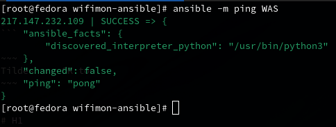
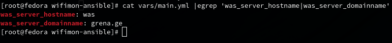
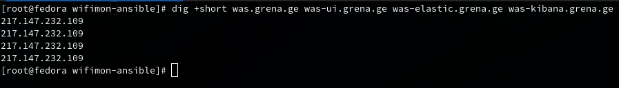

# Info

> #### Supported Operating Systems
>
> - Debian 10
> - Debian 11
> - Ubuntu 20.04
> - Ubuntu 22.04

> #### Minimal Hardware Requirements for the single node installation
>
> - 4 Core
> - 8GB Ram
> - 10GB Free space

##### Check your anseble version 2.10.0 or greater. 
      ansible --version

> If your ansible version is older than 2.10.0, the playbook will stop to run. If your ditribution does not provide newer ansible version package, please upgrade it using pip (just run pip install --upgrade ansible).

##### Clone the project by running:  

	git clone https://gitlab.grena.ge/nugzar/wifimon-ansible.git

##### CD to project directory:

	cd wifimon-ansible

> Please, set the value of `<wifimon_agent_version>` variable in `vars/main.yml` to `2.0.0` or newer. Older versions of wifimon-agent packages are not supported.

# Usage for single node installation (all in one):

1. Adjust the **IP** address (or **FQDN**) under **[WAS]** section in `hosts.cfg` file. Set **IP** or **FQDN** of the server on which you plan to install **WAS**
```bash
vim hosts.cfg
```
2. Ensure, that your ansible machine have the root access over **SSH** to a target server *(add your SSH public key to /root/.ssh/authorized_keys)*
```bash
ansible -m ping WAS
```
You should see something like this:  
  

4. Ensure that the WAS server has the public **IP** address, *(or is **NATed** in public **IP**)* and **TCP** ports **80,443** are accessable from the internet.
```bash
dig +short was.grena.ge
```
5. Ensure that the **FQDN** of **WAS** *(configured as a combination of **`was_server_hostname`** and **`was_server_domainname`** variables in **`vars/main.yml`**)* has the **DNS** record of type **A** and resolves to the public **IP** of the **WAS** itself, which is set in **hosts.cfg** file under the **`[WAS]`** section.  
In our case we have:
```bash
cat vars/main.yml |egrep 'was_server_hostname|was_server_domainname'
```
  
And so, the domain name **`was.grena.ge`** resolves to the **`IP`** address, which is set in **hosts.cfg** file under the **`[WAS]`** section:
```ini
[WAS]
217.147.232.109
```
> You need to set your own variables for:
> - **`was_server_hostname:`**
> - **`was_server_domainname:`**  
> in **`vars/main.yml`** file.  
```bash
vim vars/main.yml
```

6. Following 7 **FQDNs** should be pointed to the same **IP** as **`WAS`**
   - `<was_server_hostname>-ui.<was_server_domainname>`
   - `<was_server_hostname>-flask.<was_server_domainname>`
   - `<was_server_hostname>-anomaly.<was_server_domainname>`
   - `<was_server_hostname>-looking-glass.<was_server_domainname>`
   - `<was_server_hostname>-probe-state.<was_server_domainname>`
   - `<was_server_hostname>-elastic.<was_server_domainname>`
   - `<was_server_hostname>-kibana.<was_server_domainname>`
> In our case we have:
>
> - was-ui.grena.ge
> - was-elastic.grena.ge
> - was-kibana.grena.ge
> - was-flask.grena.ge
> - was-anomaly.grena.ge
> - was-looking-glass.grena.ge
> - was-probe-state.grena.ge

And, as was mentioned earlier, these domains have the same **`IP`** of **`217.147.232.109`** as the **`was.grena.ge`** domain.  
```bash
dig +short was.grena.ge was-ui.grena.ge was-elastic.grena.ge was-kibana.grena.ge
```
  

7. Adjust some additional variables (like package versions, database username, admin password) in `vars/main.yml` file. **Do not use** the default passwords in production! **Set your own secure passwords!**
```bash
vim vars/main.yml
```
8. Run the command:
```bash
ansible-playbook wifimon.yml
```
9. Have a coffee and come back in a few minutes.

10. Access the wifimon web-ui `https://<was_server_hostname>-ui.<was_server_domainname>`  
We have the url:  
   <https://was-ui.grena.ge>
> Credentials are
> - **`<wifimon_admin_email>`** 
> - **`<wifimon_admin_pass>`**  
> defined in **`vars/main.yml`**.

> If you have not changed the admin credentials in **`vars/main.yml`** file, defaults are:
> - **Email: admin@test.com**
> - **Password: th1sIs@Secret**

> Credentails for the second login window ***(login in kibana)*** are:
> - **`username:`** **`elastic`**
> - **`password:`** **`<elastic_elasticsearch_password>`**  
> defined in **`vars/main.yml`**  

11. To show wifimon-agent logs run the command:

```bash
journalctl -f wifimon.service
```

12. To send the logs to the logstash using `filebeat`, configure output section in `/etc/filebeat/filebeat.yml` as follow:  
```yml
    output.logstash:
      hosts: ["<was_server_hostname>-elastic.<was_server_domainname>:5044"]
      ssl.certificate_authorities:
        - /etc/ssl/certs/ca-certificates.crt   
```

# Usage for multi node installation (dedicated servers for elasticsearch, kibana and wifimon-agent):

Please note, multi-node installation was never testes with wifimon version 2.3.0. For wifimon version 2.3.0 use all-in-one installation method. For multi-node method, use wifimon version 2.2.0 or older.

1. Adjust IP addresses (or FQDNs) under [WAS], [WAS_ELASTIC], [WAS_KIBANA], [WAS_PGSQL] and [WAS_LOGSTASH] in hosts.cfg file. Set IPs or FQDNs of the servers on which you plan to install WAS, elasticsearch, kibana, PostgreSQL and Logstash. Do not forgot to set value of variable <wifimon_database_host> to PostgreSQL servers address (usually it is the same address you set as [WAS_PGSQL] in hosts.cfg)
2. Ensure you have root access over SSH to target servers (add your SSH public key to /root/.ssh/authorized_keys)
3. Adjust some variables (like package versions, database username, admin password) in vars/main.yml file. Do not use default passwords in production! Set your own secure passwords!
4. Ensure that WAS, WAS_ELASTIC, WAS_KIBANA servers have public IPs, or are NATed in public IPs and TCP ports 80,443 are accessable from internet on these IPs
5. Ensure that WAS_LOGSTASH server has public IP, or is NATed in public IPs and TCP port 5044 are accessable from internet on these IPs
6. Ensure that WAS servers FQDN (configured as was_server_hostname was_server_domainname variables in vars/main.yml) has DNS record of type A which resolves to WAS servers public IP
7. Ensure that WAS_ELASTIC servers FQDN have DNS records of type A which resolves to WAS_ELASTIC servers public IP like this:
   <br>
   ```<was_server_hostname>-elastic.<was_server_domainname>``` where ```<was_server_hostname>``` and ```<was_server_domainname>``` are variable values defined in vars/main.yml (for examle was-elastic.example.com)
8. Ensure that WAS_KIBANA servers FQDN have DNS records of type A which resolves to WAS_KIBANA servers public IP like this:
   <br>
   ```<was_server_hostname>-kibana.<was_server_domainname>``` where ```<was_server_hostname>``` and ```<was_server_domainname>``` are variable values defined in vars/main.yml (for examle was-kibana.example.com)
9. Ensure that WAS_UI FQDN have DNS records of type A which resolves to WAS servers public IP like this:
   <br>
   ```<was_server_hostname>-ui.<was_server_domainname>``` where ```<was_server_hostname>``` and ```<was_server_domainname>``` are variable values defined in vars/main.yml (for examle was-ui.example.com)
9. Ensure that WAS_FLASK FQDN have DNS records of type A which resolves to WAS servers public IP like this:
   <br>
   ```<was_server_hostname>-flask.<was_server_domainname>``` where ```<was_server_hostname>``` and ```<was_server_domainname>``` are variable values defined in vars/main.yml (for examle was-flask.example.com)
9. Ensure that WAS_ANOMALY FQDN have DNS records of type A which resolves to WAS servers public IP like this:
   <br>
   ```<was_server_hostname>-anomaly.<was_server_domainname>``` where ```<was_server_hostname>``` and ```<was_server_domainname>``` are variable values defined in vars/main.yml (for examle was-anomaly.example.com)
10. Ensure that WAS_LOGSTASH FQDN have DNS records of type A which resolves to WAS_LOGSTASH servers public IP like this:
   ```<was_server_hostname>-logstash.<was_server_domainname> where <was_server_hostname> and <was_server_domainname>``` are variable values defined in vars/main.yml (for examle was-logstash.example.com)
11. Run Commands in this order:
```bash
   ansible-playbook -i hosts.cfg 01-elasticsearch.yml
   ansible-playbook -i hosts.cfg 02-kibana.yml
   ansible-playbook -i hosts.cfg 03-postgresql.yml
   ansible-playbook -i hosts.cfg 04-wifimon-agent.yml
   ansible-playbook -i hosts.cfg 05-logstash.yml
```
12. Access wifimon web-ui ```https://<was_server_hostname>-ui.<was_server_domainname>``` where ```<was_server_hostname>``` and ```<was_server_domainname>``` are variable values defined in vars/main.ym (for examle was-ui.example.com).
   Credentials are ```<wifimon_admin_email> <wifimon_admin_pass>``` where ```<wifimon_admin_email> <wifimon_admin_pass>``` are variable values defined in vars/main.yml.
   If you do not changed admin credentials in vars/main.yml, defaults are Email: ```admin@test.com```, Password: th1sIs@Secret.
   Credentails for second login window (login in kibana) are username: elastic password: ```<elastic_elasticsearch_password>``` . Where ```<elastic_elasticsearch_password>``` is value of variable defined in vars/main.yml
13. To show wifimon-agent logs run command on WAS server: 
```bash
    journalctl -f wifimon.service
```
14. To send logs to logstash using filebeat, configure output section in /etc/filebeat/filebeat.yml as follow:
```yml
    output.logstash:
      hosts: ["<was_server_hostname>-logstash.<was_server_domainname>:5044"]
      ssl.certificate_authorities:
        - /etc/ssl/certs/ca-certificates.crt
``` 
   where ```<was_server_hostname>``` and ```<was_server_domainname>``` are variable values defined in vars/main.yml (for examle was-logstash.example.com)
